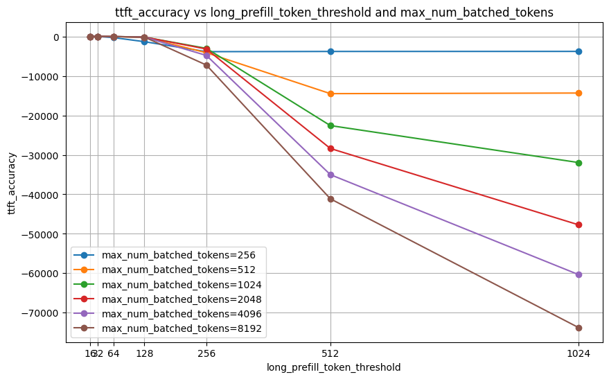

# Experiment 03: [Blackbox Optimizer Test 3]

**Date**: 07/10/2026

**Author**: Diya

**Status**: [In Progress]

## Purpose/Goal

Different experiments on blackbox optimization to boost performance across chunking scenarios.
[Issue](https://github.com/inference-sim/inference-sim/issues/45)

## How to Reproduce

* Pull the `inference-sim` repo and copy file blackbox_opt.ipynb into it.
* Put both `inference-sim` and `pytools` under a broader `inference-sim-package` directory. Copy `sim_data_analysis.ipynb` into this broader directory.

**Code Changes**: 
In cell 1 of `sim_data_analysis.ipynb`, update `vllm_dir` and `sim_dir` to the folders where your vllm and simulation benchmark results are saved.

If you wish to try the experiments with warm start with baseline parameters, comment the current `pbounds` in `blackbox_opt.ipynb` and uncomment the below 4-5 lines below it to directly use bounds tied to the baseline values.

```python
pbounds = {}
for coeff in baseline_values:
    lower_bound = baseline_values[coeff]*0.9
    upper_bound = baseline_values[coeff]*1.1
    pbounds[coeff] = (min(lower_bound, upper_bound), max(lower_bound, upper_bound))
```

In `blackbox_opt.ipynb`, once you run cell 4 and 5 for the optimizer, copy the output of cell 5 into the cell that starts with `# Test on current best parameters`. 

## Analysis

Data from the baseline:

> Error: -0.24095235318951336


* We have 2 kinds of optimizer training experiments:
    * Random init - with random pbounds for the optimizer coefficients. 
        * Train on lptt = 16, mbnt = 256

        
        
        > Optimizer does horibble on more relaxed chunking scenarios. (Higher thresholds)

        * Train on lptt = [16, 32], mbnt = [256, 512]

        

        > Optimizer still does pretty bad on higher chunking thresholds. 

        * Train on lptt = [16, 32, 64. 128], mbnt = [256, 512, 1024]

        

        > Optimizer still does pretty bad on higher chunking thresholds. 

        * Train on lptt = [16, 32, 64, 128, 256, 512, 1024], mbnt = [256, 512, 1024, 2048, 4096, 8192]

        

        > Performance for the tighter chunking scenarios (lower thresholds) improves compared to baseline , but performance for the higher thresholds suffers compare to baseline. 

    * Init from baseline - pbounds 10% lower and higher than the baseline coefficients.

    

    > Performance improves for both the lower and higher chunking thresholds, but the improvement is minimal. 


## Key Takeaways
**Findings**: 

Baseline values are already very good, we don't need to optimizer from random values. Instead warm starting our optimization using the baseline coefficients yields slightly better results and helps more in generalization. 

**Future Work**: 

Suggested follow-up experiments:

* Increasing optimization rounds 
* Trying regularization for the error function
* Tuning the error function
* Correct metric for evaluation (percentage error etc.)
